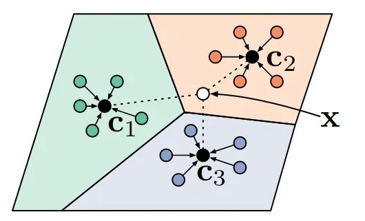
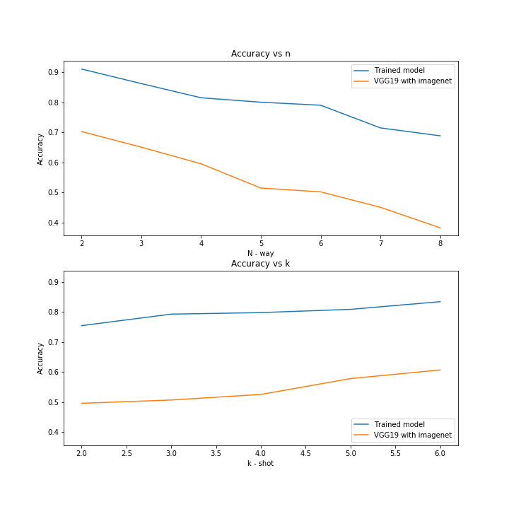

# Few Shot Learning

## Introduction
Deep learning has been a huge success in the previous decace. With advancements in computational power and a boom in 
data capturing techniques, we've seen networks and architectures constantly raising the bar in the realms of 
computer vision problems.  

However, these deep learning frameworks suffer from one significant flaw - these architectures are extremely data 
hungry require extensively high computation time and resources, either of which might not be available for a myriad 
of Furthermore, data collection, preprocessing and annotation are expensive tasks requiring dedicated process flows 
which can often take time to be implemented in a usable manner. 

Few shot learning is one of the solutions that can be used in these cases to tackle the problem of image 
classification. **FSL** is a form of meta learning which can be applied to cases where there is a limited amount of 
training samples with supervised information at hand. FSL that could drastically reduce the turnaround time of 
building machine learning applications as a low-cost solution in some of these cases. 

There are different approaches to implement a few shot learning algorithm. To name a few - 
1. [Matching Networks](https://arxiv.org/pdf/1606.04080.pdf): A differentiable nearest-neighbours classifier
2. [Prototypical Networks](https://arxiv.org/pdf/1703.05175.pdf): Learning prototypical representations
3. [Model-agnostic Meta-Learning](https://arxiv.org/pdf/1703.03400.pdf): Learning to fine-tune

In this repository, we've implemented FSL using Prototypical Networks. 

## Few shot learning - a n way, k shot algorithm

A typical few shot learning task involves **"n"** classes, each with **"k"** sample annotated images. There are also 
sample **"q"** labeled test images which can help evaluate a model's performance. The algorithm runs as follows:

- A pre-trained model, is provided with n previously unseen classes of new data
- Each of these would have k annotated images, and these n*k images form the support dataset
- Using the k images for each class from the support dataset, the model computes *(and not learns)* a metric space, 
  or an embedding for each of the n class. e.g. a vgg 19 network has 1000 features as a part of its penultimate 
  layer. This layer generates 1000\*k vectors for rach of the n classes, which can be averaged over each class to 
  generate a 1000\*1 embedding for rach class.
- Using a similar mechanism, the model generates embeddings for each of the query images. 
- The embedding for each of the query images can be compared to the averaged out embeddings for each of the support 
  class embeddings, to find a predicted class which has the minimum distance.

While there are difference mechanisms of calculating this minimum distance, the paper suggests using euclidean 
distances over cosine distance in metric learning. This intuition is backed up by experiments as the authors find that 
both ProtoNets and their own implementation of Matching Networks are improved across the board by swapping from cosine 
to euclidean distance.

This paper achieves the highest performance on typical benchmarks of all of the approaches in this article while 
also being elegant and easy to reproduce.

## Current implementation
### Data
This repository uses data from the [Grocery Store Dataset](https://github.com/marcusklasson/GroceryStoreDataset). This 
repository contains the dataset of natural images of grocery items. All natural images was taken with a smartphone 
camera in different grocery stores. There are 5125 natural images from 81 different classes of fruits, vegetables, and 
carton items (e.g. juice, milk, yoghurt). The 81 classes are divided into 42 coarse-grained classes, where e.g. the 
fine-grained classes 'Royal Gala' and 'Granny Smith' belong to the same coarse-grained class 'Apple'. For each 
fine-grained class, the authors have downloaded an iconic image and a product description of the item, where some 
samples of these can be seen on this page below. The dataset was presented in the paper "A Hierarchical Grocery 
Store Image Dataset with Visual and Semantic Labels", which appeared at WACV 2019.

The dataset had the data split into 3 main classes - Fruit, Packages and Vegetables, each in turn having multiple 
coarse classes. We selected the fruit subtype for our experiments. From the fruits subclass, we selected 10 coarse 
classes for training our model, each of which had a varied number of sample images. 

### Training and evaluation
As a backbone of our architecture, we selected a vgg19 model with imagenet weights. We trained our model for 50 
epochs using the 10 classes we'd selected earlier, freezing the conv nets and only training the dense layers. 
After training, we removed the last layer of this vgg19 architecture. Values for n were varied from 2 to 9, and k 
was varied from 2 to 7. We selected 5 images for the query dataset.
We saw a general rise in accuracy values as we moved to a higher value of k, while the score decreased for higher 
values of n. 
As another point of comparision, we also compared our scores against another vgg19 model, this time using only 
imagenet weights. Though the general trends for n and k vs accuracy were common across both these models, the scores 
were generally higher for the models we trained on the grocery images.  

